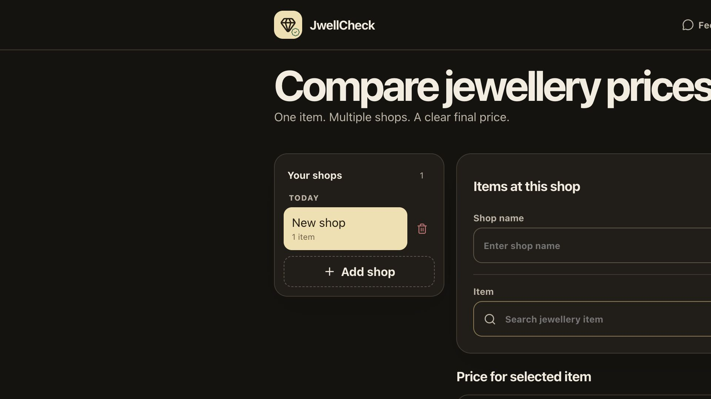
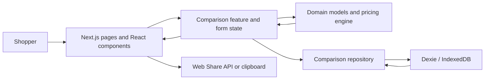

# JwellCheck

JwellCheck is a responsive jewellery quotation comparison application for shoppers who want to understand the complete cost of an item before buying it. It compares matching jewellery and precious-metal items across multiple shops and explains how the final price is formed from the metal rate, weight, making charge, discount, GST, additional fees, and an optional estimated tourist refund.

The application currently stores all comparison data in the user's browser. It does not require an account and does not send quotation data to an application server.

## Application preview



> **Important:** JwellCheck is a comparison aid, not a jewellery valuation, authenticity service, tax adviser, or guarantee of refund eligibility. Confirm the final amount and purchase conditions with the retailer.

## Why this project exists

Two shops can quote different final prices for apparently similar jewellery even when their advertised metal rates look close. Differences can come from weight, purity, making-charge method, tax, discounts, fees, stones, or refund assumptions. Missing information can also make an incomplete quote appear artificially cheap.

JwellCheck puts those inputs into one consistent calculation and helps the shopper answer:

- What will I pay at each shop?
- Which charges create the difference?
- Which complete quotation has the lowest final cost?
- Are the items sufficiently similar to compare?
- Is important information missing?

## Main use cases

### Jewellery shopper

Compare a ring, necklace, chain, bangle, earrings, diamond jewellery, or another item across two or more shops before deciding where to buy.

### Tourist shopper

Compare the shop-payable amount separately from an optional estimated tourist refund. Refund figures remain estimates and are never presented as guaranteed.

### Precious-metal buyer

Compare gold or silver bars, biscuits, and coins using weight, purity, total cost, and effective price per gram.

### Returning shopper

Keep quotations in the current browser, update prices, add shops or items, and share the best saved results with family or friends.

## Benefits

- **Transparent totals:** see the metal value and every adjustment contributing to the price.
- **Fairer comparison:** compare complete quotations instead of only the advertised rate per gram.
- **Fewer manual calculations:** fixed and percentage charges are calculated consistently.
- **Immediate feedback:** the price summary updates while values are entered.
- **Private by default:** comparison data stays in IndexedDB on the current device.
- **No account required:** users can begin without registration.
- **Responsive experience:** the interface supports desktop, tablet, mobile, and screens down to 320 px.
- **Simple sharing:** use the device share menu when supported or copy a summary to the clipboard.

## Features

- Organise quotations shop by shop and add multiple items to each shop.
- Search or select jewellery types such as necklace, ring, kangan, jhumka, coin, or gold biscuit.
- Record purity, weight, rate per gram, making charge, GST, discount, refund, and notes.
- Choose no making charge, a fixed making charge, or a percentage making charge.
- Choose no discount, a fixed discount, or a percentage discount.
- Mark **No making charge**, **No GST**, or **No tourist refund** with one action.
- Show the percentage equivalent of a fixed making charge.
- Display a live price breakdown and effective price per gram.
- Rank complete quotations for matching items by final effective cost.
- Save automatically to browser storage and explicitly save quote edits.
- Clear all locally stored comparison data after confirmation.
- Provide dedicated Feedback, Reach us, and Buy us a coffee pages.

New forms do not contain sample financial values. Item, weight, shop, rate, making charge, GST, discount, and refund start blank. Purity alone defaults to `22K (916)`.

## How to use JwellCheck

1. Select **Add first shop** or **New shop**.
2. Enter the shop name.
3. Select the jewellery item, purity, and weight in grams.
4. Enter the shop's metal rate per gram.
5. Select the making-charge method and enter its value when applicable.
6. Enter GST, or select **No GST** if it does not apply.
7. Open **More options** to add a discount, tourist refund estimate, or notes.
8. Review the live price summary and select **Save**.
9. Add another shop and enter a matching item with its quotation.
10. Select **Compare prices** to rank complete matching quotations.
11. Select **Share** to send or copy a concise comparison summary.

Items are matched for comparison using their item name/category, purity, and weight. Use consistent details across shops when the quotations refer to the same item.

## Price calculation

JwellCheck calculates a quotation in a fixed sequence so that every shop is evaluated consistently. The implemented source of truth is [`src/domain/pricing/calculator.ts`](src/domain/pricing/calculator.ts).

### Formula variables

| Symbol | Meaning                              | Example unit   |
| ------ | ------------------------------------ | -------------- |
| `P`    | Metal price or shop rate per gram    | S$/g           |
| `W`    | Item weight used for the calculation | g              |
| `M`    | Making-charge value                  | S$, %, or S$/g |
| `F`    | Total additional fixed fees          | S$             |
| `D`    | Discount value                       | S$ or %        |
| `G`    | GST percentage                       | %              |
| `R`    | Tourist-refund value                 | S$ or %        |

Percentage inputs are entered as ordinary percentages. For example, enter `9` for 9%, and the formula converts it to `9 / 100`.

### 1. Metal value

The base metal value is the shop's rate per gram multiplied by the item's weight:

```text
Metal Value = P × W
```

For a rate of S$100/g and a weight of 10 g:

```text
Metal Value = 100 × 10 = S$1,000.00
```

Purity is recorded to help match comparable items, but the calculator does not apply an additional purity multiplier. The entered rate per gram is expected to be the shop's rate for the selected purity.

### 2. Making charge

The calculation depends on the selected making-charge method:

```text
No making charge:  Making Charge = 0
Fixed amount:      Making Charge = M
Percentage:        Making Charge = Metal Value × (M / 100)
Per gram:          Making Charge = M × W
Unknown:           Making Charge = unknown
```

When a fixed amount is entered, the interface can also explain its percentage equivalent:

```text
Equivalent Making % = (Fixed Making Charge / Metal Value) × 100
```

This equivalent percentage is informational only; it does not add another charge.

### 3. Subtotal before discount

The known cost before discounts and GST is:

```text
Subtotal Before Discount = Metal Value + Making Charge + Additional Fees
```

### 4. Discount

JwellCheck supports no discount, a fixed discount, or a percentage discount:

```text
No discount:  Discount = 0
Fixed:        Discount = D
Percentage:   Discount = Subtotal Before Discount × (D / 100)
Unknown:      Discount = unknown
```

The discount is applied before GST. The taxable subtotal is never allowed to become negative:

```text
Taxable Subtotal = max(0, Subtotal Before Discount − Discount)
```

### 5. GST and shop-payable price

GST is calculated on the taxable subtotal after the discount:

```text
GST Amount = Taxable Subtotal × (G / 100)

Shop Payable Price = Taxable Subtotal + GST Amount
```

The **Shop Payable Price** is the estimated amount paid to the retailer before receiving any later tourist refund.

### 6. Tourist refund and final cost

The refund can be omitted, fixed, or calculated as a percentage of the GST-inclusive shop-payable price:

```text
No refund:  Refund = 0
Fixed:      Refund = R
Percentage: Refund = Shop Payable Price × (R / 100)
Unknown:    Refund = unknown
```

The final effective cost is:

```text
Final Cost = max(0, Shop Payable Price − Refund)
```

The `max(0, ...)` rule prevents a discount or refund from producing a negative price.

### 7. Effective price per gram

For an item with a positive weight:

```text
Effective Price Per Gram = Final Cost / W
```

This is a shopping-comparison metric. It includes making charges, fees, discounts, GST, and refunds, so it is not the raw market value of the metal.

### Complete percentage formula

When the making charge and discount are percentages, there are no additional fees, and the refund is also a percentage, the calculation can be written as one formula:

```text
Final Cost = P × W
             × (1 + M/100)
             × (1 − D/100)
             × (1 + G/100)
             × (1 − R/100)
```

This compact formula is only valid for that particular combination of percentage-based inputs. The step-by-step pricing engine is authoritative for fixed charges, per-gram charges, fixed discounts, additional fees, or fixed refunds.

### Calculation order summary

```text
1. Metal Value             = P × W
2. Making Charge           = selected making-charge formula
3. Subtotal Before Discount = Metal Value + Making Charge + F
4. Discount                = selected discount formula
5. Taxable Subtotal        = max(0, Subtotal Before Discount − Discount)
6. GST                     = Taxable Subtotal × (G / 100)
7. Shop Payable Price      = Taxable Subtotal + GST
8. Refund                  = selected refund formula
9. Final Cost              = max(0, Shop Payable Price − Refund)
10. Effective Price/Gram   = Final Cost / W
```

### Worked example

Assume a 10 g item with the following quotation:

| Input                    |    Value |
| ------------------------ | -------: |
| Rate per gram            | S$100.00 |
| Weight                   |     10 g |
| Fixed making charge      | S$150.00 |
| Additional fees          |   S$0.00 |
| Discount                 |     None |
| GST                      |       9% |
| Estimated tourist refund |     6.5% |

JwellCheck calculates it as follows:

```text
Metal Value        = S$100.00 × 10                 = S$1,000.00
Making Charge      = fixed amount                  =   S$150.00
Taxable Subtotal   = S$1,000.00 + S$150.00         = S$1,150.00
GST                = S$1,150.00 × 9%               =   S$103.50
Shop Payable Price = S$1,150.00 + S$103.50         = S$1,253.50
Estimated Refund   = S$1,253.50 × 6.5%             =    S$81.48
Final Cost         = S$1,253.50 − S$81.48          = S$1,172.02
Effective Price/g  = S$1,172.02 / 10               =   S$117.20/g
```

### Rounding and incomplete values

- Every monetary stage is rounded to two decimal places using the implemented pricing helper.
- Non-finite numeric form values, such as an empty field represented by `NaN`, are safely treated as zero so the UI never displays `NaN`.
- An **unknown** making charge, discount, or tourist refund is not presented as confirmed zero. It produces a warning and marks the quotation as incomplete.
- The calculator can still show the total of known values for an incomplete quotation, but that quotation is not eligible for best-price ranking.
- The estimated refund does not guarantee eligibility or the amount a tourist will actually receive.

## Technology stack

| Area           | Technology                     | Purpose                                                               |
| -------------- | ------------------------------ | --------------------------------------------------------------------- |
| Web framework  | Next.js 16 App Router          | Routing, rendering, metadata, manifest, sitemap, and production build |
| UI             | React 19 + TypeScript          | Typed, component-based interactive interface                          |
| Styling        | CSS Modules + global CSS       | Scoped components and responsive layouts                              |
| Forms          | React Hook Form                | Quote form state and efficient input handling                         |
| Local database | Dexie + IndexedDB              | Structured, browser-only storage and reactive queries                 |
| Icons          | Lucide React                   | Consistent accessible interface icons                                 |
| Unit testing   | Vitest                         | Pricing-engine and application logic tests                            |
| Testing        | Vitest                         | Fast unit tests for pricing calculations                              |
| Code quality   | ESLint + Prettier + TypeScript | Linting, formatting, and static type checking                         |

## Architecture

JwellCheck uses a small layered frontend architecture. The UI does not calculate prices or access IndexedDB directly when a domain or repository abstraction is available.



### Layer responsibilities

- **Presentation (`src/app`, `src/components`):** routes, page shells, metadata, navigation, and reusable UI.
- **Feature (`src/features`):** comparison workflow, forms, responsive dashboard, feedback, contact, and support experiences.
- **Domain (`src/domain`):** jewellery, shop, quote, and result types plus deterministic pricing rules.
- **Infrastructure (`src/infrastructure`):** IndexedDB configuration, migrations, queries, and persistence operations.

### Data flow

1. The shopper enters item and quote information in a React form.
2. React Hook Form holds active edits and produces a live quote preview.
3. The pure pricing engine returns a `QuoteBreakdown` without accessing the UI or database.
4. Repository functions save items, shops, and quotes through Dexie.
5. `useLiveQuery` reacts to IndexedDB changes and refreshes the dashboard.
6. Matching complete quotes are calculated, sorted, and shown in comparison results.

## Project structure

```text
jwellcheck/
├── public/                       Static images and public assets
├── src/
│   ├── app/                      Routes, metadata, manifest and global styles
│   │   ├── contact/              Reach-us page
│   │   ├── feedback/             Feedback page
│   │   └── support/              Buy-us-a-coffee page
│   ├── components/               Shared navigation and page-shell components
│   ├── domain/
│   │   ├── models.ts             Business entities and result types
│   │   └── pricing/              Pure calculator and unit tests
│   ├── features/
│   │   ├── comparison/           Main dashboard and responsive styling
│   │   ├── contact/              Contact feature
│   │   ├── feedback/             Feedback form
│   │   └── support/              Coffee invitation form
│   ├── infrastructure/
│   │   ├── database/             Dexie database and schema
│   │   └── repositories/         Local persistence operations
├── package.json                  Dependencies and project commands
└── vitest.config.mts             Test configuration
```

## What the application looks like

### Desktop dashboard

The desktop experience keeps shops on the left and the active quote workspace on the right. The live price card remains visible beside the quote fields, allowing the user to understand each change immediately.

```text
┌──────────────────────────────────────────────────────────────────────────────┐
│ JwellCheck       Feedback  Reach us  Coffee     Saved automatically  Share  │
├──────────────────────────────────────────────────────────────────────────────┤
│ Compare jewellery prices                              [ + New shop ]         │
│ One item. Multiple shops. A clear final price.                               │
├───────────────────┬──────────────────────────────────────────────────────────┤
│ YOUR SHOPS       3│ Items at this shop                         [ + Add item ] │
│                   │ Shop name  [____________________________]                │
│ Today             │ Item [Ring ▼]  Purity [22K ▼]  Weight [8.25 g]          │
│ • Shop A · 2 items├───────────────────────────────────┬──────────────────────┤
│   Ring            │ Price for selected item           │ PRICE SUMMARY        │
│   Necklace        │ [No making] [No GST] [No refund] │ Metal value   S$...  │
│ • Shop B · 1 item │ Rate/g [____]  Charge [_______]   │ Making charge S$...  │
│ • Shop C · 1 item │ GST    [____]  More options       │ GST           S$...  │
│                   │ Notes  [______________________]   │ Final cost    S$...  │
│ [ + Add shop ]    │                         [ Save ]  │ Effective/g   S$...  │
└───────────────────┴───────────────────────────────────┴──────────────────────┘
```

### Comparison results

After at least two complete matching quotations are saved, the results section ranks shops by final effective price and highlights the best complete price.

```text
┌─────────────────────────────────────────────────────────────┐
│ Comparison results                              [ Collapse ]│
├─────────────────────────────────────────────────────────────┤
│ Ring · 22K (916) · 8.25 g                                  │
│ 1  Shop B                 BEST PRICE              S$1,234.00│
│ 2  Shop A                                         S$1,281.50│
│ 3  Shop C                                         S$1,319.20│
└─────────────────────────────────────────────────────────────┘
```

### Mobile layout

On smaller screens, the sidebar becomes shop and item selectors. Forms and the price summary stack vertically, while primary actions remain easy to reach.

```text
┌────────────────────────────┐
│ JwellCheck          Share  │
├────────────────────────────┤
│ Compare jewellery prices  │
│ [ + New shop ]            │
│                            │
│ Choose shop               │
│ [ Shop A              ▼ ] │
│                            │
│ Items at this shop        │
│ Shop name [____________]  │
│ Item      [ Ring       ▼] │
│ Purity    [ 22K (916)  ▼] │
│ Weight    [ 8.25        ] │
│                            │
│ Price for selected item   │
│ Rate/gram [____________]  │
│ Making    [ Percentage ▼] │
│ GST       [ 9           ] │
│ [ More options ]          │
│                  [ Save ] │
│                            │
│ Price summary             │
│ Final cost     S$1,234.00 │
│ [ Compare saved prices ]  │
└────────────────────────────┘
```

### Supporting pages

| Route       | Page                 | Purpose                                                                |
| ----------- | -------------------- | ---------------------------------------------------------------------- |
| `/`         | Comparison dashboard | Add shops and items, calculate prices, compare, save, clear, and share |
| `/feedback` | Feedback             | Prepare feedback for the project owner                                 |
| `/contact`  | Reach us             | Display contact information                                            |
| `/support`  | Buy us a coffee      | Send or locally save a coffee invitation                               |

The diagrams above document the information hierarchy rather than exact pixel dimensions. The implemented CSS Modules control the final responsive spacing, colours, typography, and breakpoints.

## Local development

### Requirements

- Node.js 20 or newer
- npm
- A modern browser with IndexedDB support

### Install and run

```bash
git clone <repository-url>
cd jwellcheck
npm install
npm run dev
```

Open [http://localhost:3000](http://localhost:3000).

### Production build

```bash
npm run build
npm start
```

### Optional environment variable

Create `.env.local` when a separate coffee-invitation recipient is needed:

```bash
NEXT_PUBLIC_COFFEE_INVITE_EMAIL=coffee@example.com
```

The feedback form opens the visitor's configured email application with a prepared draft addressed to `akashkr2929@gmail.com`. The coffee invitation form shows a two-second confirmation and opens a prepared email draft. It uses `NEXT_PUBLIC_COFFEE_INVITE_EMAIL` when configured and otherwise sends the draft to `akashkr2929@gmail.com`.

## Available commands

| Command             | Description                                      |
| ------------------- | ------------------------------------------------ |
| `npm run dev`       | Start the Next.js development server             |
| `npm run build`     | Create an optimized production build             |
| `npm start`         | Run the production server                        |
| `npm run lint`      | Run ESLint                                       |
| `npm run typecheck` | Check TypeScript without emitting files          |
| `npm test`          | Run the Vitest test suite once                   |
| `npm run format`    | Format the project with Prettier                 |
| `npm run check`     | Run lint, typecheck, tests, and production build |

Before opening a pull request or deploying, run:

```bash
npm run check
```

## Browser storage

JwellCheck uses an IndexedDB database named `jwellcheck`. Items, shops, quotations, and session metadata remain on the current browser and device.

The **Clear** action removes all item, shop, and quotation records after confirmation. This cannot be undone. Clearing browser site data, using private browsing, or opening the application in another browser or device produces a separate empty workspace.

## Privacy, security, and limitations

- No IP address is used as a user or device identity.
- No application account is currently required.
- Comparison data is not synchronized between devices.
- Browser storage is not a substitute for a cloud backup.
- Clearing local site data permanently removes the saved workspace from that browser.
- Native sharing depends on browser and operating-system support.
- Tourist refunds are estimates and depend on retailer participation and customer eligibility.
- JwellCheck does not verify purity, authenticity, craftsmanship, stone quality, valuation, or whether two designs are identical.
- A lower calculated price does not by itself establish better quality or value.

## Future architecture options

The current browser-only architecture is appropriate for a private MVP. Possible later additions include:

- Optional accounts and encrypted cross-device synchronization
- Export and import for backup and recovery
- Shareable private comparison links
- Receipt or quotation image attachment
- PDF and image exports
- More detailed stone, certification, and repeatable-fee fields
- Quote freshness warnings and historical comparisons
- Country-specific tax and tourist-refund modules

These are future directions and are not part of the current implementation.

## License

No open-source license has been added yet. Unless a license is provided, the source code remains under its owner's default copyright rights.
